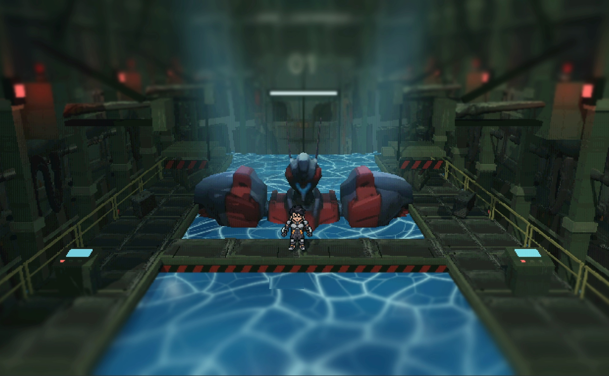
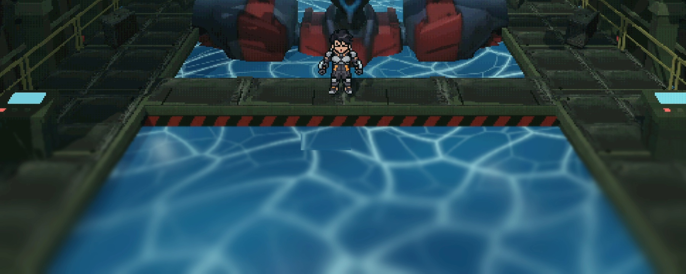
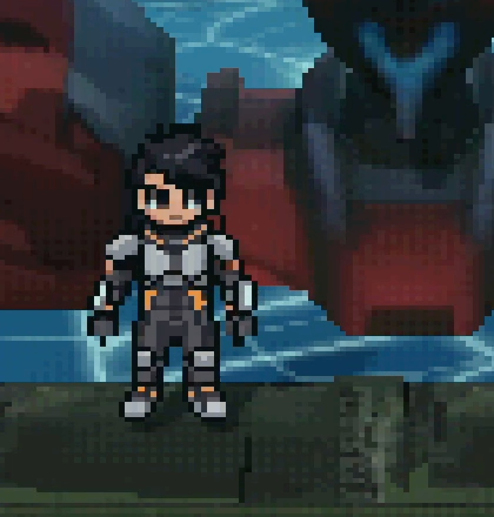

# HANGAR 01 — 격납고 01

**제노기어스의 눈높이로 에반게리온의 격납고를 다시 세운 실시간 씬.**
3D로 세운 격납고 위에 2D 픽셀 도트를 얹어, 고전 JRPG의 카메라로 거대 기체를 올려다보게 만들었습니다.
아래 이미지는 전부 Godot 런타임 출력이며 후보정은 없습니다.



## 무엇에서 왔는가

- **제노기어스 (Xenogears, 1998)** — 폴리곤으로 세운 공간 위를 2D 스프라이트 캐릭터가 걸어 다니는 구성,
  그리고 사람 키의 몇 배짜리 기체를 올려다보는 낮은 카메라. 이 프로젝트의 **형식**은 여기서 왔습니다.
- **신세기 에반게리온** — 대칭 정비 발판, 전면 다리, 올리브색 패널 벽, 적색 경고등,
  안쪽 벽의 `01` 표식, 그리고 기체가 잠긴 청색 도크. 이 프로젝트의 **공간**은 여기서 왔습니다.

레퍼런스 재현이 목적이므로 원작의 자산은 쓰지 않았습니다. 형태는 전부 새로 생성했습니다.

## 제작 파이프라인 — Tripo · Astra · Godot

세 도구가 각자 가장 잘하는 구간만 맡습니다.
**모든 자산은 Astra와 Tripo로 만들었습니다. 구입 에셋은 없습니다.**

| | 도구 | 맡은 일 |
|---|---|---|
| 01 | **Tripo** — 3D Generation | 기체와 격납고 구조물의 3D 형태. 정면·측면 실루엣이 정해지면 이후 모든 연출의 기준 부피가 됩니다. |
| 02 | **Astra** — Art & Pixel | 파일럿 스프라이트(8방향 Idle / Walking), 배경 톤, 픽셀 질감. 3D 형태 위에 얹힐 색과 명암의 규칙을 정합니다. |
| 03 | **Godot** — Assembly & Runtime | 씬 조립, 조명·피사계 심도·물 셰이더·카메라. 최종 화면은 모두 엔진 렌더링 결과입니다. |

```
형태 생성  →  아트 · 도트  →  씬 조립  →  조명 · 셰이더  →  실시간 플레이
 TRIPO        ASTRA          GODOT       GODOT            RUNTIME
```

## 화면이 푸는 문제

픽셀 캐릭터와 3D 공간은 원래 다른 격자에 삽니다. 두 레이어가 같은 세계에 있다고 느끼게 만드는 것이
이 씬의 유일한 과제였고, 세 가지로 풀었습니다.



- **해상도의 합의** — 화면 전체에 640×480 픽셀 격자와 채널당 32단계 색상을 거는 PSX 표현.
  3D 렌더 해상도를 낮추는 대신 화면 셰이더로 격자를 만들어, 3D 구조물도 도트로 읽히게 했습니다.
- **빛** — 수조의 커스틱 무늬가 거의 유일한 광원처럼 공간을 아래에서 밀어 올립니다.
  청록빛 볼류메트릭 안개와 위에서 내려오는 두 줄기 스포트라이트가 깊이를 만듭니다.
- **흐림** — 기체가 선 중앙 띠만 선명하게 남기는 틸트 시프트. 앞쪽 난간은 또렷하고
  안쪽으로 갈수록 흐려져, 평면이 되기 쉬운 픽셀 화면에 원근이 생깁니다.

## 기체와 파일럿



- **UNIT 01 — MECH** · 붉은 장갑과 청회색 내골격의 대비로 형태를 나눕니다.
  Tripo가 낸 3D 메시 위에 픽셀 톤을 얹어, 다각형의 부피감은 유지하면서 표면은 도트로 읽히게 했습니다.
- **PILOT — SPRITE** · 회색과 주황 포인트만 쓰는 좁은 팔레트. 배경이 어두운 격납고이므로
  색보다 실루엣이 먼저 읽히도록 어깨와 다리의 외곽선을 굵게 유지했습니다.
- **SCALE** · 파일럿 한 명의 키가 기체 팔 두께에 못 미칩니다. 이 비율 하나로 격납고의 실제 크기가 설명됩니다.

## 사양

| | |
|---|---|
| ENGINE | Godot 4.7 · Forward+ |
| 3D ASSETS | Tripo |
| ART / PIXEL | Astra |
| CAPTURE | 3456 × 2234 · 59.85 fps · 20.0 s |

---

# 실행과 조작

F6으로 `scenes/mecha_hangar.tscn`을 실행하거나 F5로 프로젝트를 실행합니다.

- `WASD` / 방향키: 플레이어 이동 (현재 카메라 기준)
- `Shift`: 플레이어 달리기

- `1`: 기본 정면 구도
- `2`: 사선 구도
- `3`: 상단 구도
- `P`: PSX 화면 효과 켜기 / 끄기
- `T`: 틸트 시프트 렌즈 효과 켜기 / 끄기
- 마우스 오른쪽 버튼을 누른 채 `WASD`: 카메라 이동, 마우스: 시선 회전
- `Q` / `E`: 카메라 로컬 아래 / 위, `Shift`: 빠르게 이동
- `R`: 현재 카메라 원위치, `Esc`: 마우스 해제

> `addons/Tripo3d_Godot_Bridge` 는 로컬 `~/GodotAddons/` 를 가리키는 심볼릭 링크입니다.
> 다른 머신에서 클론하면 링크가 깨지므로, 에디터에서 애드온을 끄거나 해당 경로를 직접 채워야 합니다.

# 기술 노트

## 씬 구성

씬 트리의 01~09 그룹에서 도크, 벽, 플랫폼, 정비 암, 로봇, 소품, 작업자, 조명, 카메라를 개별 수정할 수 있습니다. 구조물은 실제로 저장된 메시 노드이며 런타임 생성에 의존하지 않습니다. `scenes/player.tscn`의 2D 스프라이트 플레이어가 앞쪽 다리에서 시작합니다. 이동 범위는 앞쪽 다리와 양옆 통로의 전면 구간으로 제한하며, 전체 구조물의 물리 충돌은 구현하지 않았습니다. 우클릭 카메라 조작 중에는 플레이어가 멈춥니다.

## 생성 자산의 분해와 재사용

기존 Tripo 씬과 FBX 파일은 보존했습니다. 격납고 FBX 내부의 연결 성분 106개를 `TripoModels/hangar_separated/hangar_loose_parts.glb`로 분리했으며, 원래 UV와 텍스처를 유지했습니다. 이 중 벽, 플랫폼, 정비 암, 도어, 호스, 드럼통, 상자, 경고등, 제어함을 현재 씬에 재사용했습니다. 각 메시의 `source_part` 메타데이터와 노드 이름으로 원본 조각 번호를 확인할 수 있습니다.

큰 배치와 구조 지지대, 난간, 도크 바닥은 기존 구성입니다. 로봇은 기존 FBX의 텍스처를, 추출한 환경 부품은 원본 격납고 텍스처 아틀라스를 사용합니다. 이전에 코드로 생성했던 표면 노이즈 텍스처는 제거했습니다. 원본 부품은 방향과 크기를 조정했으며, 생성 메시의 비뚤어진 외형을 일부 유지했습니다.

## PSX 표현

최근접 텍스처 필터, 무광 재질, 화면상 640×480 픽셀 격자, 채널별 32단계 색상과 약한 디더링으로 구성했습니다. 실제 3D 렌더 해상도를 낮추는 방식은 아니며, 화면 셰이더가 픽셀 격자를 표현합니다. `P`로 화면 효과만 비교할 수 있고, 에디터에서는 `10_PSXPresentation`의 표시 여부나 `shaders/psx_display.gdshader`의 파라미터로 조정할 수 있습니다.

## 틸트 시프트와 대기

틸트 시프트 효과는 `11_TiltShift/LensBlur`에서 적용합니다. 로봇이 있는 중앙 띠는 선명하게 유지하고 화면 상하단으로 갈수록 부드럽게 흐려지는 화면 공간 효과입니다. `shaders/tilt_shift.gdshader`의 `focus_center`(초점 높이), `focus_half_width`(선명한 띠의 반폭), `falloff`(전환 폭), `tilt`(띠 기울기), `blur_amount`(흐림 강도)를 조정할 수 있습니다. PSX 처리 뒤에 적용하며 `P`와 `T`로 각각 비교할 수 있습니다. 씬 재생성 시에도 유지됩니다.

선명한 띠는 화면 높이의 44%로 넓혀 흐림 범위를 가장자리로 줄였습니다. `HangarAtmosphere`의 Environment에 청록빛 볼류메트릭 안개를 적용하고, `08_Lighting/GodRayLeft`와 `GodRayRight`의 그림자 지원 스포트라이트로 위에서 내려오는 빛줄기를 표현합니다. 안개 농도는 `volumetric_fog_density`, 빛줄기 강도는 각 조명의 `light_volumetric_fog_energy`, 폭은 `spot_angle`로 조정합니다. 기존 조명의 안개 기여도는 낮춰 전체가 밝게 뜨는 것을 줄였습니다.

## 표면 셰이더

단색으로 남던 기둥·보·난간·플랫폼 측면에는 `shaders/atlas_surface.gdshader`를 적용했습니다. 원본 Tripo 아틀라스의 금속 패널 구역을 직접 샘플링하여 기존 색상에 명암 질감을 입힙니다. 월드 좌표 기준으로 반복하므로 긴 구조물에서도 질감이 늘어나지 않으며, `atlas_region`, `tiles_per_meter`, `texture_strength`로 범위·크기·강도를 조정할 수 있습니다. 원본 텍스처 파일 자체는 수정하지 않았습니다.

`PurplePitFloor`에는 `shaders/pit_water.gdshader`의 청색 수면 재질을 적용했습니다. 월드 좌표 기반 잔물결, 부드럽게 변형되는 두 겹의 청록색 코스틱 무늬와 움직이는 표면 노멀을 사용합니다. 기존 메시 위치와 크기를 유지하며, 불투명 수면으로 표현합니다. 재질의 `wave_speed`, `wave_scale`, `normal_strength`, `highlight_strength`, `ripple_center`와 세 가지 색상을 조정할 수 있습니다. 씬 재생성 시에도 수면 재질이 적용됩니다.

## 플레이어

플레이어는 `sprites/player`에 압축 해제한 8방향 Idle / Walking 에셋을 사용합니다. 정지 시 대기 애니메이션, 이동 시 8방향 걷기 애니메이션을 재생합니다. Shift 달리기 시 재생 속도도 빨라지며, 통로 경계에 막혀 멈추면 대기 상태로 돌아갑니다. `scripts/player.gd`의 속도와 이동 범위, 플레이어 씬의 `pixel_size`로 크기를 조정할 수 있습니다.

## 씬 재생성

`tools/build_hangar.gd`는 배치 생성 원본입니다. 아래 명령은 **저장된 격납고 씬을 다시 생성하므로 에디터에서 직접 수정한 내용은 덮어씁니다.**

```sh
godot --headless --path . --script tools/build_hangar.gd
```

미리보기 갱신: `godot --path . --script tools/capture_hangar.gd`
