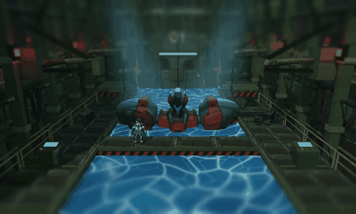

# HANGAR 01

**An Evangelion hangar rebuilt at Xenogears' eye level, running in real time.**
2D pixel sprites laid over a 3D hangar, framed with a classic JRPG camera so you look *up* at the machine.
Every image below is raw Godot runtime output — no post-processing.



<sub>10 s of the 20 s capture, straight from the engine — 720 px, 10 fps, no editing beyond the crop.</sub>

## Where it comes from

- **Xenogears (1998)** — 2D sprite characters walking across polygonal space, and a low camera that
  makes a mech several times a person's height. The **form** of this project comes from here.
- **Neon Genesis Evangelion** — symmetrical maintenance gantries, the front bridge, olive panel walls,
  red warning lamps, the `01` marking on the back wall, and the blue dock the unit stands in.
  The **space** comes from here.

This is a reference reconstruction, so no original assets were used. Every shape was generated from scratch.


## Pipeline — Tripo · Astra · Godot

Three tools, each owning only the stretch it does best.
**Every asset was made with Astra and Tripo. No purchased assets.**

| | Tool | Owns |
|---|---|---|
| 01 | **Tripo** — 3D Generation | The 3D forms of the unit and the hangar structures. Once the front and side silhouettes are fixed, they become the reference volume for everything after. |
| 02 | **Astra** — Art & Pixel | The pilot sprite (8-direction idle / walking), background tone, pixel texture. Sets the rules of color and shading that sit on top of the 3D forms. |
| 03 | **Godot** — Assembly & Runtime | Scene assembly, lighting, depth of field, water shader, camera. The final image is all engine rendering. |

```
generate form  →  art · pixels  →  assemble scene  →  light · shade  →  play in real time
    TRIPO           ASTRA             GODOT              GODOT             RUNTIME
```

## The problem the image solves

Pixel characters and 3D space natively live on different grids. Making the two layers feel like one world
was the only real task in this scene, and it is solved three ways.


- **Agreeing on resolution** — a PSX presentation pass puts a 640×480 pixel grid and 32 levels per color
  channel over the whole screen. Rather than dropping the 3D render resolution, a screen shader draws the
  grid, so the 3D structures read as dots too.
- **Light** — the caustics in the dock push the space up from below like they were the only light source.
  Teal volumetric fog and two shadow-casting spotlights from above build the depth.
- **Blur** — a tilt-shift keeps only the central band, where the unit stands, sharp. The near railing is
  crisp and everything inward softens, giving perspective to a picture that would otherwise read flat.

## Unit and pilot


- **UNIT 01 — MECH** · Red armor against a blue-grey endoskeleton splits the form. A pixel tone laid over
  Tripo's 3D mesh keeps the polygonal mass while letting the surface read as dots.
- **PILOT — SPRITE** · A narrow palette of grey with orange accents. The hangar is dark, so silhouette has
  to read before color — the shoulder and leg outlines are kept heavy.
- **SCALE** · The pilot is shorter than the thickness of the unit's arm. That one ratio explains the size
  of the whole hangar.

## Specification

| | |
|---|---|
| ENGINE | Godot 4.7 · Forward+ |
| 3D ASSETS | Tripo |
| ART / PIXEL | Astra |
| CAPTURE | 3456 × 2234 · 59.85 fps · 20.0 s |
| CLIP ABOVE | 720 × 433 · 10 fps · 10.0 s, cropped from that capture |

---

# Running and controls

Press F6 to run `scenes/mecha_hangar.tscn`, or F5 to run the project.

- `WASD` / arrow keys: move the player (relative to the current camera)
- `Shift`: run

- `1`: default front framing
- `2`: diagonal framing
- `3`: top-down framing
- `P`: toggle the PSX screen effect
- `T`: toggle the tilt-shift lens effect
- Hold right mouse button + `WASD`: fly the camera; mouse: look
- `Q` / `E`: camera-local down / up, `Shift`: move faster
- `R`: reset the current camera, `Esc`: release the mouse

> `addons/Tripo3d_Godot_Bridge` is a symlink into a local `~/GodotAddons/`. Cloning this repo elsewhere
> leaves the link broken — disable the addon in the editor, or populate that path yourself.

# Technical notes

## Scene structure

Groups `01`–`09` in the scene tree let you edit the dock, walls, platforms, maintenance arms, robot, props,
workers, lighting and cameras independently. The structures are real saved mesh nodes and do not depend on
runtime generation. The 2D sprite player in `scenes/player.tscn` starts on the front bridge. Movement is
limited to the front bridge and the near stretch of the side walkways; physics collision for the full
structure is not implemented. The player holds still while the right-mouse camera is being driven.

## Splitting and reusing generated assets

The original Tripo scenes and FBX files are preserved. The 106 connected components inside the hangar FBX
were split out into `TripoModels/hangar_separated/hangar_loose_parts.glb` with their original UVs and
textures intact. Of those, the walls, platforms, maintenance arms, doors, hoses, drums, crates, warning
lamps and control boxes are reused in the current scene. The `source_part` metadata and node name on each
mesh identify the original part number.

The overall layout, structural supports, railings and dock floor are original composition. The robot uses
its own FBX textures; the extracted environment parts use the original hangar texture atlas. Procedural
surface noise textures used earlier were removed. Original parts were reoriented and rescaled, and some of
the crookedness of the generated meshes was deliberately kept.

## PSX presentation

Nearest-neighbor texture filtering, unshaded materials, a 640×480 on-screen pixel grid, 32 levels per color
channel and light dithering. The 3D render resolution itself is not lowered — a screen shader draws the
pixel grid. `P` isolates the screen effect for comparison; in the editor, toggle `10_PSXPresentation` or
tune the parameters in `shaders/psx_display.gdshader`.

## Tilt-shift and atmosphere

The tilt-shift lives on `11_TiltShift/LensBlur`. It is a screen-space effect that keeps the central band —
where the robot stands — sharp and softens smoothly toward the top and bottom of the frame. Tune
`focus_center` (band height), `focus_half_width` (half-width of the sharp band), `falloff` (transition
width), `tilt` (band angle) and `blur_amount` (blur strength) in `shaders/tilt_shift.gdshader`. It is
applied after the PSX pass; `P` and `T` compare each independently. It survives scene regeneration.

The sharp band was widened to 44% of screen height to push the blur out to the edges. The Environment on
`HangarAtmosphere` carries teal volumetric fog, and the shadow-casting spotlights `08_Lighting/GodRayLeft`
and `GodRayRight` produce the shafts coming down from above. Fog density is `volumetric_fog_density`, shaft
strength is `light_volumetric_fog_energy` on each light, and width is `spot_angle`. Existing lights had
their fog contribution lowered so the whole frame does not wash out.

## Surface shaders

Columns, beams, railings and platform sides that used to read as flat color now use
`shaders/atlas_surface.gdshader`. It samples the metal-panel region of the original Tripo atlas directly and
lays that shading over the existing color. Tiling is in world space, so the texture does not stretch across
long structures; `atlas_region`, `tiles_per_meter` and `texture_strength` control region, scale and
strength. The source texture files themselves are untouched.

`PurplePitFloor` uses the blue water material in `shaders/pit_water.gdshader`: world-space ripples, two
layers of softly deforming teal caustics, and a moving surface normal. Mesh position and size are unchanged
and the surface is opaque. Tune `wave_speed`, `wave_scale`, `normal_strength`, `highlight_strength`,
`ripple_center` and the three colors. The water material survives scene regeneration.

## Player

The player uses the 8-direction idle / walking assets unpacked into `sprites/player`. It plays the idle
animation when stopped and the matching 8-direction walk when moving. Shift speeds up playback as well as
movement, and hitting a walkway boundary returns it to idle. Speed and movement bounds are in
`scripts/player.gd`; size is the `pixel_size` on the player scene.

## Regenerating the scene

`tools/build_hangar.gd` is the source of the layout. The command below **regenerates the saved hangar scene
and will overwrite anything edited by hand in the editor.**

```sh
godot --headless --path . --script tools/build_hangar.gd
```

Refresh previews: `godot --path . --script tools/capture_hangar.gd`
